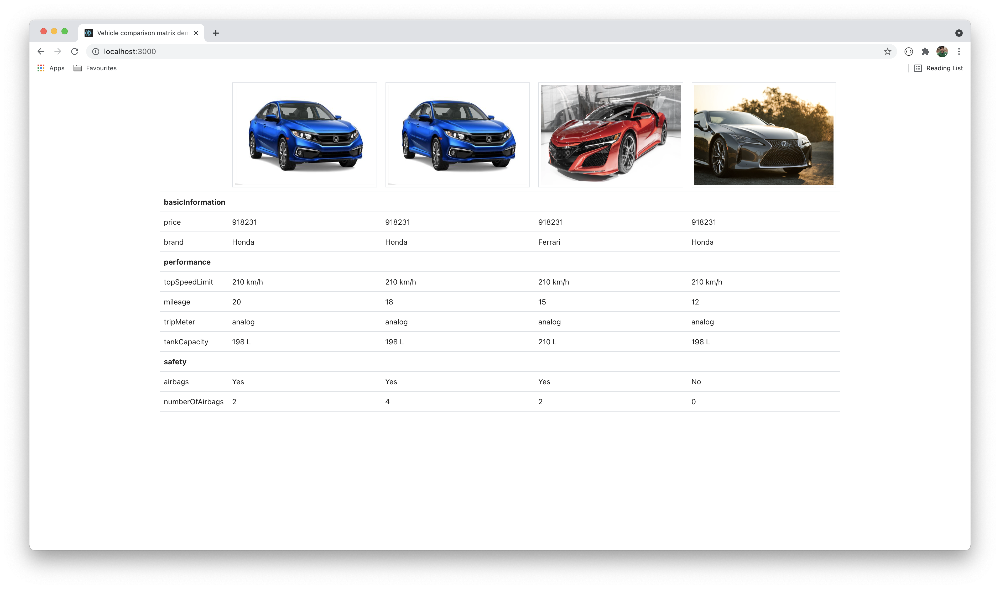

# Vehicle comparison using dynamic data



### Sample data

```json
{
    "data": {
        "content": {
            "basicInformation": {
                "price": [918231.0, 918231.0, 918231.0, 918231.0],
                "brand": ["Honda", "Honda", "Ferrari", "Honda"]
            },
            "performance": {
                "topSpeedLimit": [
                    "210 km/h",
                    "210 km/h",
                    "210 km/h",
                    "210 km/h"
                ],
                "mileage": [20, 18, 15, 12],
                "tripMeter": ["analog", "analog", "analog", "analog"],
                "tankCapacity": ["198 L", "198 L", "210 L", "198 L"]
            },
            "safety": {
                "airbags": ["Yes", "Yes", "Yes", "No"],
                "numberOfAirbags": [2, 4, 2, 0]
            }
        },
        "ids": [
            "611b408711424726b58388d6",
            "611b408b11424726b58388d7",
            "611e1622c9e50f4b5d413b84",
            "611e37ecc9e50f4b5d413b85"
        ],
        "images": [
            "https://hips.hearstapps.com/hmg-prod.s3.amazonaws.com/images/2019-honda-civic-sedan-1558453497.jpg?crop=1xw:0.9997727789138833xh;center,top&resize=480:*",
            "https://hips.hearstapps.com/hmg-prod.s3.amazonaws.com/images/2019-honda-civic-sedan-1558453497.jpg?crop=1xw:0.9997727789138833xh;center,top&resize=480:*",
            "https://images.unsplash.com/photo-1560361586-8242b1fc06c5?ixid=MnwxMjA3fDB8MHxwaG90by1wYWdlfHx8fGVufDB8fHx8&ixlib=rb-1.2.1&auto=format&fit=crop&w=1186&q=80",
            "https://images.unsplash.com/photo-1577496549804-8b05f1f67338?ixid=MnwxMjA3fDB8MHxwaG90by1wYWdlfHx8fGVufDB8fHx8&ixlib=rb-1.2.1&auto=format&fit=crop&w=1050&q=80"
        ]
    },
    "success": true
}
```
